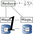
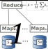
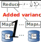
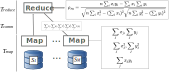
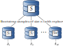

```{r xaringan-themer, include=FALSE, warning=FALSE}
#This block contains the theme configuration for the CSS lab slides style
library(xaringanthemer)
library(showtext)
style_mono_accent(
  base_color = "#5c5c5c",
  text_font_size = "1.5rem",
  header_font_google = google_font("Arial"),
  text_font_google   = google_font("Arial", "300", "300i"),
  code_font_google   = google_font("Fira Mono")
)
```

```{r setup, include=FALSE}
options(htmltools.dir.version = FALSE)
```


layout: true
<div class="my-footer"><span>David Garcia - Scalable Algorithms for Statistical Inference from Big Data </span></div> 


---
# Lecture Background and Objectives

**So far in Big Data Management and Analysis:**
- Streaming Synopses and Clustering
- NoSQL
- Large-scale Data Storage and Processing
- **MapReduce**
  
**Lecture objectives:**
1. Understand the necessity of computer science in large-scale modern statistics    
2. Learn the Divide and Conquer paradigm for scalable statistics
3. Learn how bootstrapping can be scalable

**Lecture resources:**
https://dgarcia.eu/ScalableInference
---
# When data goes big

```{r, echo=F, message=F, fig.width=14, fig.height=5.25, fig.align='center', dev='svg'}
library(ggplot2)
df <- read.csv("DataVolume.csv", sep="\t")
ggplot(df, aes(x=Year, y=Volume, group=Source, fill=Source)) + 
  geom_bar(stat="identity") + theme_bw() + 
  theme(legend.position=c(0.2,0.7), text = element_text(size = 24), 
        legend.title = element_blank()) + ylab("Data volume (Zettabytes)")
```

## How big was the biggest dataset you ever used?

---
# Problem example


- Billions of data points distributed in several thousand data servers
- Objectives:
  - Save time by using distributed architecture
  - Warning! Communication time matters (vs. plain parallel processing)
  - Inference should have desirable statistical properties and minimize additional error
---

## Divide and Conquer for statistical inference


---
# When things are easy: Averaging

.pull-left[]

---
# Averaging example: the case of the mean

.pull-left[]

---
# Averaging example: the case of the mean

.pull-left[]

.pull-right[
```{r, echo=F, message=F, fig.width=7, fig.height=6, fig.align='center', dev='svg'}
N <- 400 # total sample size
M <- 40  # number of machines, each one will have N/M points
truemeans <- NULL
mnmeans <- NULL
meanests <- NULL
rep <- 20
for (mn in seq(0,1, by=0.05)) # We repeat the task for means in this range
{
  for (r in seq(1,rep))
  {
    x <- rnorm(mean=mn, n=N)  # total dataset
    meanest <- mean(x)        # total dataset mean estimate
    i <- rep(seq(1,M), N/M)   # index of the machine where a point resides
    submeans <- NULL
    for (j in seq(1, M))      # loop to simulate the map step of each machine
    {
      submeans[j] <- mean(x[i==j])
    }
    
    truemeans <- c(truemeans,mn)
    meanests <- c(meanests, meanest)  # vector with means based on the whole sample
    mnmeans <- c(mnmeans, mean(submeans)) # vector with the mean across machines
  }
}
df <- data.frame(meanests, mnmeans, truemeans)

ggplot(df, aes(x=meanests, y=mnmeans)) + geom_point() + theme_bw() + 
  ylab("Distributed mean") + xlab("Whole sample estimate") + theme( text = element_text(size = 24))

```
]

---
# Averaging example: the case of the mean
.pull-left[]
.pull-right[
```{r, echo=T, eval=F, message=F, fig.width=7, fig.height=6, fig.align='center', dev='svg'}
N <- 400 # total sample size
M <- 40  # number of machines, each one will have N/M points
truemeans <- NULL;  mnmeans <- NULL; meanests <- NULL
rep <- 20
for (mn in seq(0,1, by=0.05)) # We repeat the task for means in this range
{
  for (r in seq(1,rep))
  {
    x <- rnorm(mean=mn, n=N)  # total dataset
    meanest <- mean(x)        # total dataset mean estimate
    i <- rep(seq(1,M), N/M)   # index of the machine where a point resides
    submeans <- NULL
    for (j in seq(1, M))      # loop to simulate the map step of each machine
    {
      submeans[j] <- mean(x[i==j])
    }
    
    truemeans <- c(truemeans,mn)
    meanests <- c(meanests, meanest)  # vector with means based on the whole sample
    mnmeans <- c(mnmeans, mean(submeans)) # vector with the mean across machines
  }
}


df <- data.frame(meanests, mnmeans, truemeans)

ggplot(df, aes(x=meanests, y=mnmeans)) + geom_point() + theme_bw() + 
  ylab("Distributed mean") + xlab("Whole sample estimate") + theme( text = element_text(size = 24))

```
]

---
# Averaging issues: Pearson's correlation 

.pull-left[]

---
# Averaging issues: Pearson's correlation 

.pull-left[]

.pull-right[

```{r, echo=F, message=F, fig.width=7, fig.height=6, fig.align='center', dev='svg'}
N <- 100 # total sample size
M <- 10  # number of machines, each one will have N/M points

totalcors <- NULL  
mncors <- NULL
bettercors <- NULL
rep <- 40 # number of repetitions per sd value of the noise
for (a in seq(0.01, 5, by=0.05)) # values of the sd of the noise
{
  for (r in seq(1,rep))
  {
    x <- runif(n=N) # first variable uniformly sampled
    y <- sign(runif(n=1,min=-1, max=1))*x + rnorm(mean = 0, sd = a, n=N)
    # the second variable has a random sign and a noise term of the corresponding sd
    i <- rep(seq(1,M), N/M)  # index of the machine where a point resides
    
    cors <- NULL
    for (j in seq(1, M)) # loop to simulate the map step of each machine
    { 
      cors[j] <- cor(x[i==j], y[i==j])
    }
    
    totalcors <- c(totalcors,cor(x,y))
    mncors <- c(mncors,mean(cors))  # vector with the mean of the corr. coef. across machines
  }
}


df <- data.frame(totalcors, mncors)

ggplot(df, aes(x=totalcors, y=mncors)) + geom_point() + theme_bw() + 
  ylab("Distributed correlation") + xlab("Whole sample estimate") + theme( text = element_text(size = 24))


```
]
---

# Smarter computation of correlations



---

# Smarter computation of correlations

.pull-left[]

.pull-right[

```{r, echo=F, message=F, fig.width=7, fig.height=6, fig.align='center', dev='svg'}
N <- 100 # total sample size
M <- 10  # number of machines, each one will have N/M points

totalcors <- NULL  
mncors <- NULL
bettercors <- NULL
rep <- 40 # number of repetitions per sd value of the noise
for (a in seq(0.01, 5, by=0.05)) # values of the sd of the noise
{
  for (r in seq(1,rep))
  {
    x <- runif(n=N) # first variable uniformly sampled
    y <- sign(runif(n=1,min=-1, max=1))*x + rnorm(mean = 0, sd = a, n=N)
    # the second variable has a random sign and a noise term of the corresponding sd
    i <- rep(seq(1,M), N/M)  # index of the machine where a point resides
    
    sumsx <- NULL # vectors for partial sums of correlation formula
    sumsy <- NULL
    sqsumsx <- NULL
    sqsumsy <- NULL
    sumsxy <- NULL
    for (j in seq(1, M))  # loop to simulate the map step of each machine
    {
      sumsx[j] <- sum(x[i==j])  # partial sums of the correlation formula
      sqsumsx[j] <- sum(x[i==j]^2)
      sumsy[j] <- sum(y[i==j])
      sqsumsy[j] <- sum(y[i==j]^2)
      sumsxy[j] <- sum(x[i==j]*y[i==j])
    }
    
    totalcors <- c(totalcors,cor(x,y))
    othercor <- (N*sum(sumsxy) - sum(sumsy)*sum(sumsx))/(sqrt(N*sum(sqsumsx) - sum(sumsx)^2) * sqrt(N*sum(sqsumsy) - sum(sumsy)^2))  # single-pass correlation formula as reduce step
    bettercors <- c(bettercors, othercor)
  }
}

df <- data.frame(totalcors, bettercors)

ggplot(df, aes(x=totalcors, y=bettercors)) + geom_point() + theme_bw() + 
  ylab("Distributed correlation (V2)") + xlab("Whole sample estimate") + theme( text = element_text(size = 24))


```
]
---

# Distributing bootstrapping

.pull-left[

- Option 1: one sample per machine
  - Average size of Sj ~ 0.632n
]

.pull-right[


```{r, echo=F, message=F, fig.width=7, fig.height=4.5, fig.align='center', dev='svg'}
library(latex2exp)
x <- rnorm(N) # first vector
y <- x + rnorm(N) # second vector with noise

bootcors <- NULL # vector to save bootstrap results
Nrep <- 10000 # Number of bootstrap samples
for (i in seq(1,Nrep))
{
  sel <- sample(x=N, size=N, replace=T)  # indices of bootstrap sample (with repetition)
  bootcors[i] <- cor(x[sel],y[sel])   # corr coef. in bootstrap sample
}
CI <- quantile(bootcors, probs = c(0.025, 0.975))
df <- data.frame(bootcors)
ggplot(df, aes(bootcors)) + geom_histogram(fill="gray", color="black") + geom_vline(xintercept=CI, color="red") + theme_bw() + 
  xlab(TeX("$\\widehat{\\theta_i}$"))+ annotate(geom="text", x=CI[1]-0.05, y=Nrep/10, label="95% Confidence Interval (CI)", color="red", size=6) + theme( text = element_text(size = 24), plot.title = element_text(hjust = 0.5))  + ggtitle("Bootstrap estimates")
```
- Option 2: smaller samples m <n 
  - Overestimates CI width! 
  - Imperfect heuristic corrections
]

---
# The Bag of Little Boostraps


---

# Summary

- Statistical inference on MapReduce
  - Reduce time but also have desirable statistical properties


- Averaging results of distributed computation
  - Careful when averaging! The case of Pearson's correlation coefficient


- How to distribute bootstrapping
  - The Bag of Little Bootstraps to resample across machines

**Lecture resources:** https://github.com/dgarcia-eu/ScalableInference

**To Learn More:**  
[On statistics, computation and scalability. M. Jordan (2013)](https://projecteuclid.org/journals/bernoulli/volume-19/issue-4/On-statistics-computation-and-scalability/10.3150/12-BEJSP17.full)  
[A scalable bootstrap for massive data. A. Kleiner, et al. (2014)](https://rss.onlinelibrary.wiley.com/doi/10.1111/rssb.12050)  
[Divide-and-conquer methods for big data analysis. X. Chen et al. (2021)](https://arxiv.org/abs/2102.10771)

